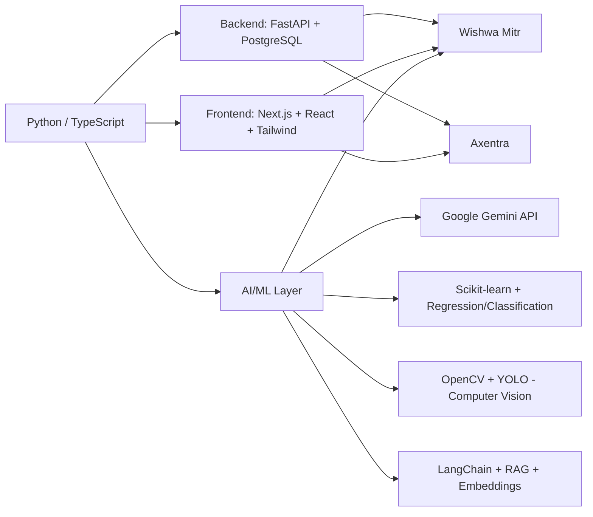

<!-- Animated Header -->

  

<h1 align="center">Hey, I'm Gopal 👋</h1>

  <b>BCA (Hons) Final-Year Student</b> · AI / Backend / Full-Stack Developer · Building things that think and scale.

  

---

### 🧠 About Me

I'm a **BCA (Hons)** final-year student at **Model Institute of Engineering & Technology (MIET), Jammu**, School of Computer Applications. I work across AI, backend, and full-stack development, and I also do graphic design and video editing on the side.

I like understanding how things work internally instead of just using them — most of my learning is project-driven: pick a real problem, build it, and learn the concepts along the way.

- 🔭 Currently building **Wishwa Mitr** — an AI-powered, multilingual learning platform for Indian school students (targeting UN SDG Goal 4), with my team **The Tech Visualizers**
- 🛠️ Also developing **Axentra** — a full-stack gig/part-time job marketplace
- 🤖 Currently working with **Generative AI** and **Agentic AI** — Google Gemini API, RAG pipelines, and AI agent workflows
- 📊 Learning **Machine Learning** and **Computer Vision** through hands-on projects (regression models, classification, OpenCV, YOLO)
- 🎬 Creative side: video editing and graphic design with **DaVinci Resolve**, **Premiere Pro**, **After Effects**, and **Canva**
- 📚 Recognized reader by MIET Jammu's Central Library
- 🌱 Currently going deeper into **Agentic AI**, **LangGraph**, **multi-agent systems**, and **vector databases**

---

### 🛠️ Tech Stack

**Languages**

**AI, GenAI & Computer Vision**

**Backend**

**Frontend**

**Tools & Platforms**

**Creative Tools**

---

### 🗺️ How My Skills Connect

---

### 🚀 Featured Projects

#### 🌍 [Wishwa Mitr — AI Educational Platform](https://github.com/YOUR_USERNAME/wishwa-mitr)
> AI-powered, multilingual tutor for Indian school students | Built for IEEE YESIST12 iEXPLORE (SDG Goal 4)

- 🤖 Gemini-powered AI tutor with multilingual support (Hindi + English)
- 📝 Auto-generates MCQ quizzes, SVG diagrams, and PYQ topic analysis
- 📈 Progress tracking with PostgreSQL + FastAPI backend
- 🌐 **Next.js · FastAPI · PostgreSQL · Google Gemini**

#### 💼 [Axentra — Gig & Part-Time Job Marketplace](https://github.com/YOUR_USERNAME/axentra)
> Full-stack platform connecting students with part-time work opportunities

- ⚛️ Built with **Next.js, React, Supabase, Framer Motion**
- 🎯 Focused on clean UX and real-world usability
- 🚀 Deployed on Vercel

#### 🏏 Cricket Score Prediction (Machine Learning)
> Linear Regression model to predict cricket scores, with full documentation

- 📊 Data preprocessing, EDA, and feature engineering
- 📈 Model evaluation with visualizations (Matplotlib)
- 📁 Part of ongoing ML/Data Science documentation work

#### 👁️ Computer Vision & Object Detection
> Projects exploring image processing and detection pipelines

- 🎥 OpenCV fundamentals — image processing, annotation, tracking
- 🎯 Object detection using **YOLO**
- 🧪 Applied learning through a Smart Class Monitoring System (IoT + CV concept)

#### 🧩 AI / RAG Experiments
> Learning and prototyping Retrieval-Augmented Generation systems

- 🔍 Embeddings, vector search, and a Student Handbook RAG prototype
- 🛠️ Built with LangChain fundamentals and Gemini API
- 📚 Exploring AI agent workflows and tool/function calling

---

### 📚 What I've Learned So Far

- Python fundamentals, OOP, file & exception handling
- SQL basics and data analysis with Pandas
- Machine Learning workflow: training, evaluation, model serialization (Joblib)
- Building ML apps with Streamlit
- OpenCV fundamentals, image processing, object detection (YOLO)
- Git & GitHub workflow (branching, internals, four-zone flow)
- Prompt engineering and LLM roles (system/user/assistant)
- Embeddings, vector representations, and RAG fundamentals
- LangChain tools and basic AI agent workflows

### 🌱 Currently Learning

- Advanced RAG architectures & vector databases
- AI Agents, LangGraph & multi-agent systems
- Long-term memory for AI systems
- Production-ready AI system design
- Advanced Computer Vision
- End-to-end AI product development

---

### 🎯 Long-Term Goal

To build AI products that make learning more personalized, interactive, and accessible — combining AI, computer vision, and solid software engineering to create real educational impact. I believe the best way to learn is by building, and every project teaches me something new.

---

### 📊 GitHub Stats

  
  

---

### 📫 Let's Connect

  
  
  

---

  <i>"Build it. Ship it. Improve it."</i>

